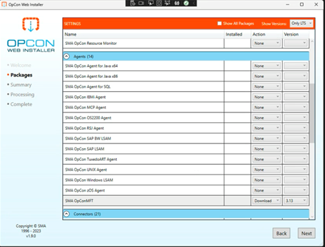
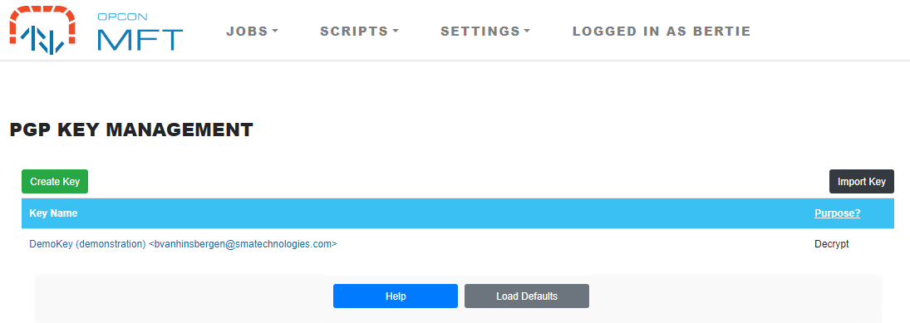
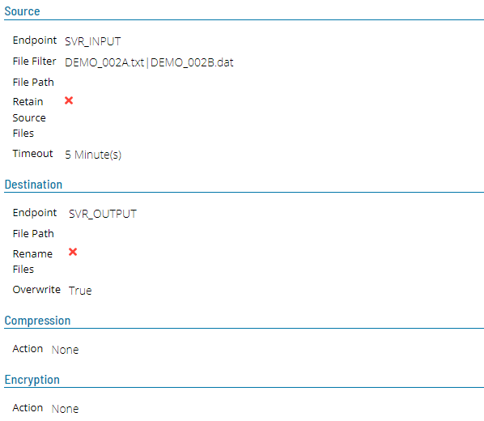
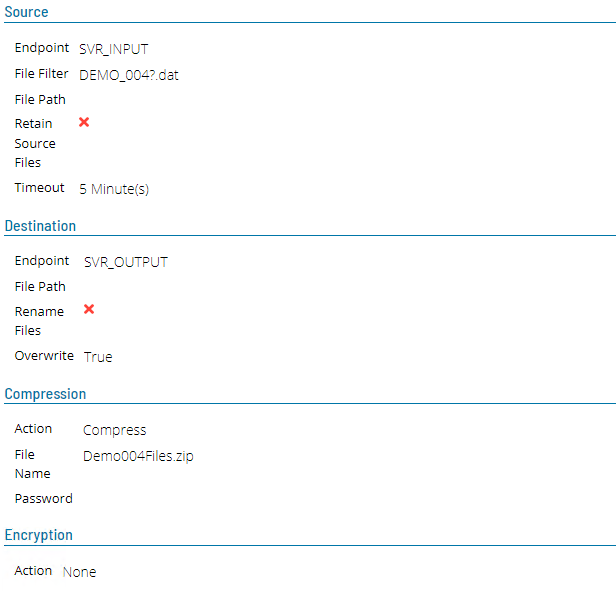
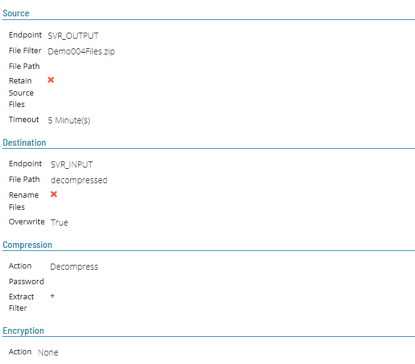
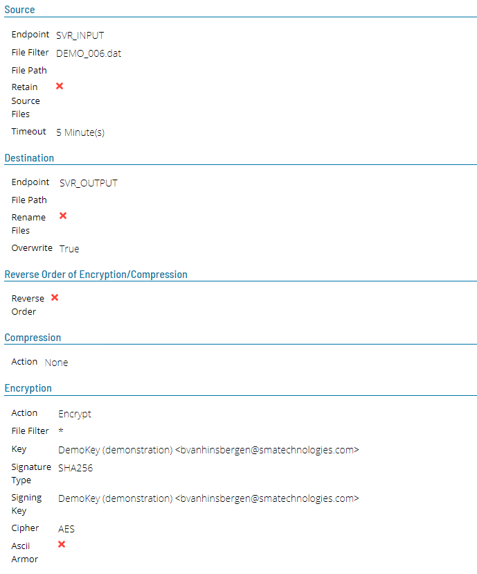
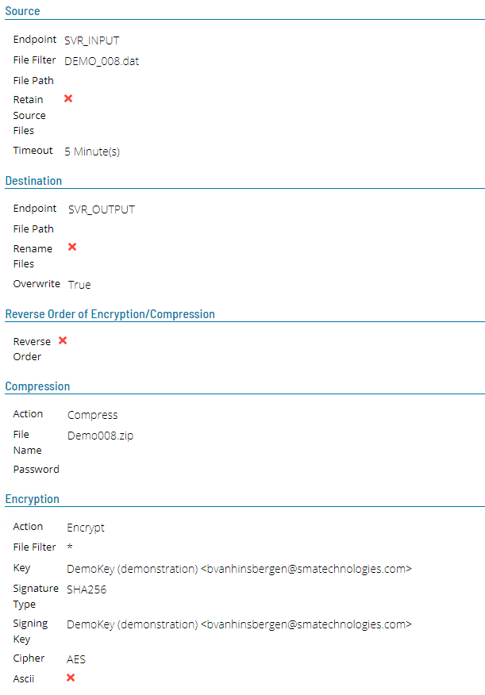

# Create Demonstration / Test Environment
This document defines how to setup a demonstration / test environment for OpCon MFT.

The demonstration will use two Path Endpoints to demonstrate moving data using the various capabilities available within OpCon MFT Agent.

- simple task moving files between endpoints using wild cards.
- simple task moving files using multiple explicit file extensions.  
- simple task moving a file between endpoints renaming the destination file and placing file in a directory using an OpCon global property
  containing a date value. 
- move a selection of files between endpoints using compression.
- move the created compressed file between endpoints, decompressing the file and placing the result in a decompressed directory.
- move a file between endpoints using encryption.
- move the created encrypted file between endpoints, decrypting the file and placing the result in a decrypted directory.
- move a file between endpoints using compression and encryption. 
- move the created compressed, encrypted file between endpoints, decrypting and decompressing the file and placing the result in a decompressed directory.

## Regex Tester
The demonstration environment includes a regex tester program in the regex-tester directory. This is a Perl program that can be used to test the **Search** and
**Replace** regex patterns.

To use this program download and install the latest version of the Perl software.

The program has three options:

Option  | Description
--------| -----------
**-s**  | (Required) A string that provides the data to perform the regex test against. 
**-p**  | (Required) A string representing the regex search pattern. 
**-r**  | (Required) A string representing the regex replace pattern. 

Examples:

Replace the extension of file with a new extension name.

```
C:\perl>perl RegexCheck.pl -p "^(.*)\.[^.]+$" -r "${1}.txt" -s "c:\file\test.dat"
--------------------------------------
searchString   = c:\file\test.dat
searchPattern  = ^(.*)\.[^.]+$
replacePattern = "${1}.txt"
match result   = c:\file\test
--------------------------------------
replace result = c:\file\test.txt
--------------------------------------
```
Move all files to a new directory, irrespective of sub-directories.

```
C:\perl>perl RegexCheck.pl -p ".*\\(.*)$" -r "all_files_go_here\\${1}" -s "c:\file\test.dat"
--------------------------------------
searchString   = c:\file\test.dat
searchPattern  = .*\\(.*)$
replacePattern = "all_files_go_here\\${1}"
match result   = test.dat
--------------------------------------
replace result = all_files_go_here\test.dat
--------------------------------------
```

Replace a directory in the path with a new value:
```
C:\perl>perl RegexCheck.pl -p "\\file\\(.*)$" -r "\\new_dir\\${1}" -s "c:\file\test.dat"
--------------------------------------
searchString   = c:\file\test.dat
searchPattern  = \\file\\(.*)$
replacePattern = "\\new_dir\\${1}"
match result   = test.dat
--------------------------------------
replace result = c:\new_dir\test.dat
--------------------------------------
```

## Requirements
The following components are required:
- Windows Server 
- OpCon version 22.0 Installation.
- Appropriate license with OpCon MFT Agent included (or 0.lic).
- Internet access to download the OpCon MFT Agent software using OpCon Web Installer.

## Create demonstration environment
On the Windows server 
- create a directory **c:\\mftdemo** and add directories **input**, **output** and **testdata**.
In OpCon create 
- a global property **$SCHEDULE DATE-YYYYMMDD** with a date format of **yyyymmdd**.
- create the **OpConMFT-Demo** schedule.
Create the following data files in the **c:\\mftdemo\\testdata** directory.
- DEMO_010.dat, DEMO_011.dat, DEMO_012.dat
- DEMO_002A.txt, DEMO_002B.dat
- DEMO_003.dat
- DEMO_004A.dat, DEMO_004B.dat
- DEMO_006.dat
- DEMO_007.dat
- DEMO_008.dat

## OpCon SMAMftAgentProxy Installation
The SMAMftAgentProxy is contained within the SMANetCom environment and is installed automatically when the core SMA OpCon 22.0 component is installed.

## OpCon MFT Agent Installation
The OpCon MFT Agent software can be downloaded using the OpCon Web Installer. It is listed as SMA OpConMFT under the Agents section. 
The software currently only has a download option. Once down loaded, the installer can be started manually outside the OpCon Web Installer.





### OpCon MFT Agent Configuration
Select the **OpConMFT n.nn Configurator** from the OpConMFT n.nn menu.

#### Create Self signed Certificate
A self signed certificate must be created and assigned to the OpCon MFT Agent communications link.

Select the **TLS Certificates** item and then select **Create**.

- for City/Town enter your city **your city**.
- for Organization enter **SMA**.
- for State/Province/Region enter **your state**.
- for Common Name enter **OpConMftTest**.
- for Country enter **your country**.
- for Unit enter **Consulting**.
- for Password & Verify Password enter a password value.
- for E-mail Address enter **your email address**.

Select **Create Self Signed**.

Select the **Scheduler Settings** tab of the Scheduler item.


#### Retrieve the port number of the OpCon MFT Agent
The port number displayed in the UI Port field of the Scheduler Settings tab.

#### Enable Use SSL/TLS

Select the **Use SSL/TLS** checkbox.
This will inform you that the opConMFT Service must be restarted.
Select OK and a list of certificates will be displayed.
Select the self signed certificate **OpConMftTest** you created in the previous step.
Select **OK**.

Restart the OpConMFT n.nn Scheduler Service.

Using Web Browser, login to https://localhost:port (using port number retrieved from UI Port field) to verify that the opCon MFT Agent
is running correctly.


### Configure OpConMFT Agent

Using Solution Manager.
- select **Library**.
- select **Agents**.
- select **+ Add**.
- for name enter "OpConMFTTest**.
- for Machine Type select **OpConMFT**.
- for IP Address enter the address of the system you installed the OpCon MFT Agent on.
- for Port NUmber enter the number retrieved from UI Port field.

Select the **Communication Settings** tab

Set the JORS Port number and set the value to the number retrieved from UI Port field.

Select **Save**.
If all is successful, you will get a message indicating that the config was saved and that authentication was successful. 

If there are problem authenticating, start the the **OpConMFT n.nn Configurator** from the OpConMFT n.nn menu and select the **Scheduler** item and
the **Scheduler Settings** tab.
Select the **Reset Auth Token Deadline** button.

Go back to Solution Manager, select the OpConMFT Agent you configured, select configure (**spanner** icon in upper right-hand corner) and select
the **Authenticate** button.

Start The OpConMftTest agent.

## Defining Endpoints
The demo / test implementation uses two **Path Endpoints** to manipulate files. If required additional **Managed Sites** can be defined.

Using Solution Manager:
- select **Library**.
- select **Agents**.
- select (right-click) the previously Created OpCon MFT Agent (**OpConMFT**).
- select Agent Details by clicking on the ***spanner*** icon in the top right-hand corner.
- select **OpCon MFT Agent Settings** tab.
- select **Path Endpoints**.
- On the ***Path Endpoints*** page, select **Add Site**.
- for Site Name enter **SVR_INPUT** and for Directory enter **c:\\mftdemo\\input**.
- select **OK** to save new definition.
- On the ***Path Endpoints*** page, select **Add Site**.
- for Site Name enter **SVR_OUTPUT** and for Directory enter **c:\\mftdemo\\output**.
- select **OK** to save new definition.


## Defining Encryption Key
The demo / test implementation requires a local generated encryption key that will be used to PGP encrypt and decrypt  the files.

Using Solution Manager:
- select **Library**.
- select **Agents**.
- select (right-click) the previously Created OpCon MFT Agent (**OpConMFT**).
- select Agent Details by clicking on the ***spanner*** icon in the top right-hand corner.
- select **OpCon MFT Agent Settings** tab.
- select **PGP Key Management**.
- On the ***PGP Key Management*** page, select **Create Key**.
- for Key User Name enter **DemoKey**.
- for Key Comment enter **demonstration**.
- for Key E-Mail Address enter your email address (name@smatechnologies.com).
- for Key Passphrase and Key Passphrase Verification enter **demonstrationKey** 
- ensure Save Passphrase is enabled.
- select **OK** to save new definition.





## Defining the demonstration tasks
Solution Manager must be used to define the demonstration tasks.
Before running tasks, always edit the data file contents to ensure that the file is found by the transfer process.

### Simple task moving files between endpoints using wild cards
This task will move a selection of data files using wild cards from the source end point SVR_INPUT to the destination end point SVR_OUTPUT.

#### Define the task
Using Solution Manager
- select **Library**.
- select **Master Jobs**.
- select **+ Add**:
- select Schedule **OpConMFT-Demo**.
- for name enter **Demo001**.
- select Job Type **OpConMFT**.
- select Machine **OpConMFT**.
- Source section
  - for Endpoint select **SVR_INPUT**.
  - for File Filter enter **DEMO_001?.dat**.
  - for Timeout enter 5.
- Destination section
  - for Endpoint select **SVR_OUTPUT**.
  - for Overwrite select **True**.

- select Save.  
- add appropriate Frequency.


#### Running task
- edit DEMO_001A.dat, DEMO_001B.dat and DEMO_001C.dat files changing the contents.
- copy the three files from the c:\\mftdemo\\testdata directory to the c:\\mftdemo\\input directory
- release the Demo001 job.
- result
  - all three files DEMO_001A.dat, DEMO_001B.dat and DEMO_001C.dat will be removed from the c:\\mftdemo\\input directory and placed in the c:\\mftdemo\\output directory.

### simple task moving files using multiple explicit file extensions.
This task will move a selection of data files using specific extension names from the source endpoint SVR_INPUT to the destination endpoint SVR_OUTPUT.

#### Define the task
Using Solution Manager
- select **Library**.
- select **Master Jobs**.
- select **+ Add**:
- select Schedule **OpConMFT-Demo**.
- for name enter **Demo002**.
- select Job Type **OpConMFT**.
- select Machine **OpConMFT**.
- Source section
  - for Endpoint select **SVR_INPUT**.
  - for File Filter enter **DEMO_002A.txt|DEMO_002B.dat**.
  - for Timeout enter 5.
- Destination section
  - for Endpoint select **SVR_OUTPUT**.
  - for Overwrite select **True**.
- select Save.  
- add appropriate Frequency.



#### Running task
- edit DEMO_002A.txt and DEMO_002B.dat files changing the contents.
- copy the two files from the c:\\mftdemo\\testdata directory to the c:\\mftdemo\\input directory
- release the Demo002 job.
- result
  - all three files DEMO_002A.txt and DEMO_002B.dat will be removed from the c:\\mftdemo\\input directory and placed in the c:\\mftdemo\\output directory.

### simple task moving a file between endpoints renaming the destination file and placing file in a directory using an OpCon global property   containing a date value. 
This task will move the file DEMO_003.dat from the source endpoint SVR_INPUT to destination endpoint SVR_OUTPUT, renaming the file extension and placing the file in a new directory using the global property $SCHEDULE DATE-YYYYMMDD to create a date formatted directory name.  

#### Define the task
Using Solution Manager
- select **Library**.
- select **Master Jobs**.
- select **+ Add**:
- select Schedule **OpConMFT-Demo**.
- for name enter **Demo003**.
- select Job Type **OpConMFT**.
- select Machine **OpConMFT**.
- Source section
  - for Endpoint select **SVR_INPUT**.
  - for File Filter enter **DEMO_003.dat**.
  - for Timeout enter 5.
- Destination section
  - for Endpoint select **SVR_OUTPUT**.
  -for File Path enter [[$SCHEDULE DATE-YYYYMMDD]].
  
  - enable **Rename Files**.
  - for Search Pattern enter **^(.*)\\.[^.]+$^**.
  - for Replace Pattern enter **"${1}" + ".txt"**.
  - for Overwrite select **True**.
- select Save.  
- add appropriate Frequency.


#### Running task
- edit DEMO_003.dat file changing the contents.
- copy the file from the c:\\mftdemo\\testdata directory to the c:\\mftdemo\\input directory
- release the Demo003 job.
- result
  - the file DEMO_003.dat will be removed from the c:\\mftdemo\\input directory and placed in the c:\\mftdemo\\output\\[[$SCHEDULE DATE-YYYYMMDD]] directory as DEMO_003.txt.

###  move a selection of files between endpoints using compression and a specific file name
This task will move the files DEMO_004A.dat and DEMO_004B.dat the from source endpoint SVR_INPUT to the destination endpoint SVR_OUTPUT, compressing the files into the named file Demo004Files.zip in the directory c:\\mftdemo\\output.

#### Define the task
Using Solution Manager
- select **Library**.
- select **Master Jobs**.
- select **+ Add**:
- select Schedule **OpConMFT-Demo**.
- for name enter **Demo004**.
- select Job Type **OpConMFT**.

- select Machine **OpConMFT**.
- Source section
  - for Endpoint select **SVR_INPUT**.
  - for File Filter enter **DEMO_004?.dat**.
  - for Timeout enter 5.
- Destination section
  - for Endpoint select **SVR_OUTPUT**.

   - for Overwrite select **True**.
- Compression section
  - Select Action **Compress**.
  - for File enter **Demo004Files.zip**.
- select Save.  
- add appropriate Frequency.



#### Running task
- edit DEMO_004A.dat and DEMO004B.dat files changing the contents.
- copy the file from the c:\\mftdemo\\testdata directory to the c:\\mftdemo\\input directory
- release the Demo004 job.
- result
  - the files DEMO_004A.dat and DEMO_004B.dat will be removed from the c:\\mftdemo\\input directory and placed in the c:\\mftdemo directory as Demo004Files.zip.

### move the created compressed file between endpoints, decompressing the file and placing the result in a decompressed directory.
This task will retrieve the compressed file Demo004Files.zip from the source endpoint SVR_OUTPUT, decompress the file placing the DEMO_004A.dat and DEMO_004B.dat files in the c:\\mftdemo\\input\\decompressed directory of the destination endpoint SVR_INPUT.  

#### Define the task
Using Solution Manager
- select **Library**.
- select **Master Jobs**.
- select **+ Add**:
- select Schedule **OpConMFT-Demo**.
- for name enter **Demo005**.
- select Job Type **OpConMFT**.
- select Machine **OpConMFT**.
- Source section
  - for Endpoint select **SVR_OUTPUT**.
  - for File Filter enter **Demo004Files.zip**.
  - for Timeout enter 5.
- Destination section
  - for Endpoint select **SVR_INPUT**.
  - for File Path enter **decompressed**.
  - for Overwrite select **True**.
- Compression section
  - select Action **Decompress**.
  - for Extract Filter enter **\***.
- select Save.  
- add appropriate Frequency.
- add successful completion job dependency on job Demo004. 



#### Running task
- release the Demo005 job.
- result
  - the file Demo004Files.zip will be removed from the c:\\mftdemo\\output directory, decompressed and the DEMO_004A.dat and DEMO004B.dat files placed in the c:\\mftdemo\\input\\decompressed directory.

### move a file between endpoints using encryption.
This task will move the file DEMO_006.dat from the source end point SVR_INPUT to destination endpoint SVR_OUTPUT, encrypting it and placing it in the c:\\mftdemo\\output as DEMO_006.dat.pgp.   

#### Define the task
Using Solution Manager
- select **Library**.
- select **Master Jobs**.
- select **+ Add**:
- select Schedule **OpConMFT-Demo**.
- for name enter **Demo006**.
- select Job Type **OpConMFT**.
- select Machine **OpConMFT**.
- Source section
  - for Endpoint select **SVR_INPUT**.
  - for File Filter enter **DEMO_006.dat**.
  - for Timeout enter 5.
- Destination section
  - for Endpoint select **SVR_OUTPUT**.
  - for Overwrite select **True**.
- Encryption section
  - select Action **Encrypt**.
  - for File Filter enter **\***.
  - for Key select the created key **DemoKey (demonstration) \<name@smatechnologies.com\>**.
  - for Signature Type select **SHA256**.
  - for Signing Key select **DemoKey (demonstration) \<name@smatechnologies.com\>**.
  - for Cipher select **AES**.
- select Save.  
- add appropriate Frequency.



#### Running task
- edit DEMO_006.dat file changing the contents.
- copy the file from the c:\\mftdemo\\testdata directory to the c:\\mftdemo\\input directory
- release the Demo006 job.
- result
  - the file DEMO_006.dat file will be removed from the c:\\mftdemo\\output directory, encrypted and the DEMO_006.dat.pgp file placed in the c:\\mftdemo\\output directory.

### move the created encrypted file between endpoints, decrypting the file and placing the result in a decrypted directory.
This task will retrieve the encrypted file DEMO_006.dat.pgp from the source endpoint SVR_OUTPUT, decrypt the file placing the file DEMO_006.dat in the c:\\mftdemo\\input\\decrypted directory of the destination endpoint SVR_INPUT.  

#### Define the task
Using Solution Manager
- select **Library**.
- select **Master Jobs**.
- select **+ Add**:
- select Schedule **OpConMFT-Demo**.
- for name enter **Demo007**.
- select Job Type **OpConMFT**.
- select Machine **OpConMFT**.
- Source section
  - for Endpoint select **SVR_OUTPUT**.
  - for File Filter enter **DEMO_006.dat.pgp**.
  - for Timeout enter 5.
- Destination section
  - for Endpoint select **SVR_INPUT**.
  - for File Path enter **decrypted**.
  - for Overwrite select **True**.
- Encryption section
  - select Action **Decrypt**.
  - for File Filter enter **\***.
- select Save.  
- add appropriate Frequency.
- add successful completion job dependency on job Demo006. 


#### Running task
- release the Demo007 job.
- result
  - the file DEMO_006.dat.pgp will be removed from the c:\\mftdemo\\output directory, decrypted and the DEMO_006.dat file will be placed in the c:\\mftdemo\\input\\decrypted directory.

### move a file between endpoints using compression and encryption. 
This task will move the file DEMO_008.dat from the source end point SVR_INPUT to destination endpoint SVR_OUTPUT, compressing it using a specific name, then encrypting it and placing it in the c:\\mftdemo\\output as Demo008.zip.pgp.   

#### Define the task
Using Solution Manager
- select **Library**.
- select **Master Jobs**.
- select **+ Add**:
- select Schedule **OpConMFT-Demo**.
- for name enter **Demo008**.
- select Job Type **OpConMFT**.
- select Machine **OpConMFT**.
- Source section
  - for Endpoint select **SVR_INPUT**.
  - for File Filter enter **DEMO_008.dat**.
  - for Timeout enter 5.
- Destination section
  - for Endpoint select **SVR_OUTPUT**.
  - for Overwrite select **True**.
- Compression section
  - Select Action **Compress**.
  - for File enter **Demo008.zip**.
- Encryption section
  - select Action **Encrypt**.
  - for File Filter enter **\***.
  - for Key select the created key **DemoKey (demonstration) \<name@smatechnologies.com\>**.
  - for Signature Type select **SHA256**.
  - for Signing Key select **DemoKey (demonstration) \<name@smatechnologies.com\>**.
  - for Cipher select **AES**.
- select Save.  
- add appropriate Frequency.



#### Running task
- edit DEMO_008.dat file changing the contents.
- copy the file from the c:\\mftdemo\\testdata directory to the c:\\mftdemo\\input directory
- release the Demo008 job.
- result
  - the file DEMO_008.dat will be removed from the c:\\mftdemo\\input directory, compressed into Demo008.zip, encrypted and the Demo008.zip.pgp file placed in the c:\\mftdemo\\output directory.

### move the created compressed, encrypted file between endpoints, decrypting and decompressing the file and placing the result in a decompressed directory.
This task will retrieve the compressed, encrypted file Demo008.zip.pgp from the source endpoint SVR_OUTPUT, decrypt, then decompress the file placing the file DEMO_008.dat file in the c:\\mftdemo\\input\\decompressed directory of the destination endpoint SVR_INPUT.  

#### Define the task
Using Solution Manager
- select **Library**.
- select **Master Jobs**.
- select **+ Add**:
- select Schedule **OpConMFT-Demo**.
- for name enter **Demo009**.
- select Job Type **OpConMFT**.
- select Machine **OpConMFT**.
- Source section
  - for Endpoint select **SVR_OUTPUT**.
  - for File Filter enter **Demo008.zip.pgp**.
- Destination section
  - for Endpoint select **SVR_INPUT**.
  - for File Path enter **decompressed**.
  - for Overwrite select **True**.
- Compression section
  - select Action **Decompress**.
  - for Extract Filter enter **\***.
- Encryption section
  - select Action **Decrypt**.
  - for File Filter enter **\***.
- select Save.  
- add appropriate Frequency.
- add successful completion job dependency on job Demo008. 


#### Running task
- release the Demo009 job.
- result
  - the file Demo008.zip.pgp will be removed from the c:\\mftdemo\\output directory, decrypted and then decompressed and the DEMO_006.dat file will be placed in the c:\\mftdemo\\input\\decompressed directory.