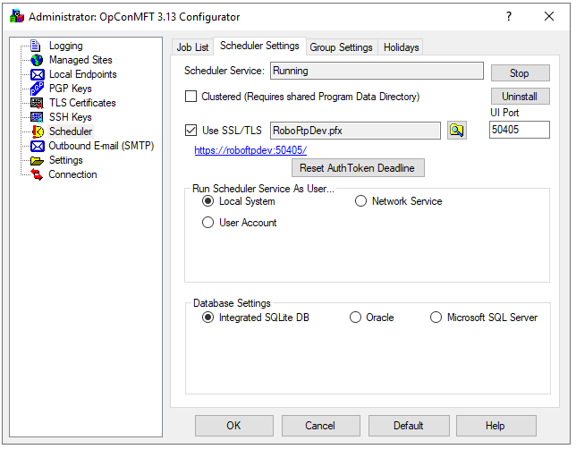
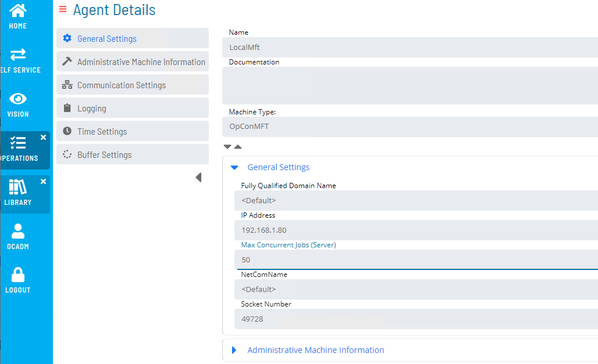

# Installation
The OpConMFT environment consists of an OpConMFT Agent and the SMAMftAgentProxy that provides the communication link between OpCon and the OpConMFT Agent.

The SMAMftAgentProxy is contained within the NetCom environment and is installed automatically when the central SMA OpCon component is installed. 

The SMAMftAgentProxy uses the new NetCom Rest-API module and provides the communications link between OpCon and the OpConMFT Agent Rest-API. There is a
one to one relationship between an OpCon environment and a OpConMFT Agent. This is due to the authentication token used between OpCon and the OpConMFT Agent.
Part of the configuration process is to retrieve the token value from the OpConMFT Agent and store this in the OpCon agent record. 

## OpConMFT Agent Installation
The agent installation consists of executing the installer program and answering a single license acceptance message.
After the installation, a system restart is required.

You need to retrieve the port number for communication with OpCon that has been automatically configured during the installation process.

Select the **OpConMFT** menu item and then the **OpConMFT Configurator** menu item.

This opens the Configurator Software.

Select the **Scheduler** option from the tree view and then the **Scheduler Settings**. The port number will be displayed in the **UI Port** field.

The connection requires an https connection. Ensure that the Use SSL/TLS option is selected. When this is selected, you will need to enter a certificate.
If you do not have a valid certificate to import, then either create the information to purchase a certificate or create a self-signed certificate.

Once this change has been made, restart the OpConMFT Service.

After the OpConMFT agent is installed, a new token value is available for download for a short period of time. If the OpConMFT OpCon Agent configuration is 
not completed within this specified time an error message will be displayed indicating that the token is not available. If this happens, then a new token must
be generated using the OpConMFT Agent software. This can be done by selecting the **Reset Auth Token Deadline** button on the **Scheduler Settings** tab of 
the **OpConMFT Configurator**. 

## OpConMFT Agent Configuration
The configuration of the OpConMFT Agent is done using Solution Manager.

From Solution Manager, select **Library** and under the **Administration** menu select **Agents**.

Select **+ Add** to configure the new OpConMFT Agent.

Enter a name for the agent and select the **OpConMFT** from the **Machine Type** drop-down list.

Open the **General Settings** tab and enter the address information, the Max Concurrent Jobs and the Socket Number (the **UI Port** number retrieved from the OpConMFT Agent Scheduler Settings tab). 

Save the configuration.

Select the **Communications Settings** tab and enter the **JORS Port Number** which is the same port number used on the previous tab ((the **UI Port** number retrieved from the OpConMFT Agent Scheduler Settings tab).

Save the configuration.

The next step is to complete the Authentication process which consists of connecting to the OpConMFT Agent for the first time and obtaining a token which will be used for future communication.
There is a timeout value of 100 seconds between the completion of the OpConMFT Agent installation and performing the initial authentication step. If this is not completed within the time frame,
it will not be possible to authenticate. The following message will be displayed **Unable to update authentication token for machine** reason ***The request was cancelled due to the configured HttpClient.Timeout of 100 seconds***. 

When this occurs it will be necessary to reset the auth token deadline and re-authenticate. See **OpConMFT Agent Installation** for process.

Go to the **Operational Agents** screen and select the created opConMFT Agent. This will display the AgentSelection tab, which includes an **Authentication** button. 
After selecting the Authentication button, a successful authentication message will appear. 

The opConMFT Agent can then be started.

