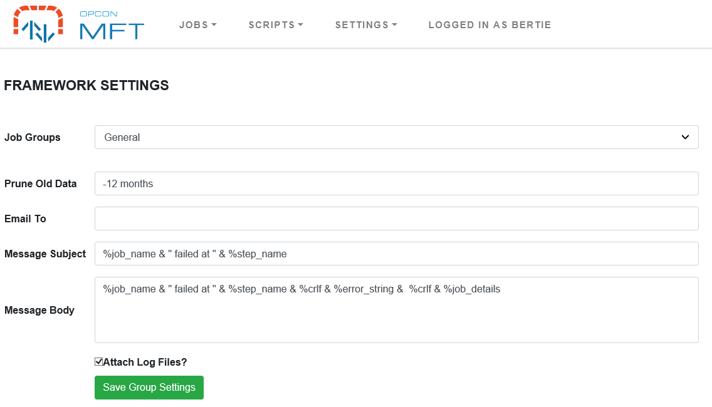

# Group Definitions
Group definitions are currently defined using the OpCon MFT Agent Web Server. A connection to the OpCon MFT Agent Web Server requires a user / password for system where the OpCon MFT Agent is installed (not an OpCon user).


To define Groups, edit the associated OpCon MFT agent details using Solution Manager.
Select the **OpCon MFT Agent Settings** TAB and then select **Settings**.
Enter the credentials for the OpCon MFT Agent Web Server in the pop-up window and you will be routed to Endpoints associated with the OpCon MFT Agent. 

From the initial page, select **SETTINGS** and then **GROUPS** for defining group information.

Tasks within the OpCon MFT Agent are associated with a specific group that defines general attributes for execution. The group name is derived
from the OpCon **Department Name** with special characters removed. The default group defined for the OpCon MFT Agent environment is **General**.
When a OpCon Task is submitted to the OpCon MFT Agent and the group associated with the request does not exist, the group will be created.

```
Example

OpCon Department Name   : <General>
OpCon MFT Group name     : General

OpCon Department Name   : Test Group
OpCon MFT Group name     : TestGroup

```
Group definition consists of defining the retention of data for the group and a default email associated with the group (recipients, subject and address).



Select the required group from the drop-down list.

Field                 | Description
--------------------- | -----------
**Prune Old Data**    | The duration that data is stored for the group before being deleted (i.e -12 months). 
**Email To**          | The email address where error notifications will be sent. To include multiple addresses, separate each one with a comma (,).
**Message Subject**   | Subject line of error notification emails (use macros to provide default information). 
**Message Body**      | Email body of error notification emails (use macros to provide default information). 
**Attach Log Files**  | Select the checkbox to attach the log files to the error notification.


It is possible to perform macro substitution in the subject and message data by using the & sign to indicate string concatenation between macros and literal quoted strings.   

The available macros are :

Macro                 | Description
--------------------- | -----------
**%year**               | The 2 digit year (i.e. 12 for 2012) 
**%month**              | The 2 digit month (i.e. 02 for February) 
**%month_abbreviation** | The 3 character month abbreviation (i.e. Feb for February)
**%day**                | The 2 digit day of the month
**%weekday**            | The 2 digit day of the week: ie Sunday is 0 and Saturday is 6 
**%day_abbreviation**   | The 3 character day of the week (i.e. Sunday is Sun)
**%hour**               | The 2 digit hour of the day 
**%minute**             | The 2 digit minute of the day 
**%step**               | The last filename processed by step 
**%step[#]**            | The period separated token from the filename (starts with 0) IE: fileid.dat.Z.pgp, %step[0] = fileid, %step[2] = Z…
**%job_details**        | The step result strings for every step processed so far 
**%job_name**           | The current job's name 
**%step_name**          | The name of the currently executing step 
**%crlf**               | A string containing the carriage return and line feed characters
 

Subject and Message Body Examples

```
Subject

%job_name & " failed at Step " & %step_name

%job_name & " failed at Step " & %step_name & %crlf & %error_string & %crlf &job_details

```