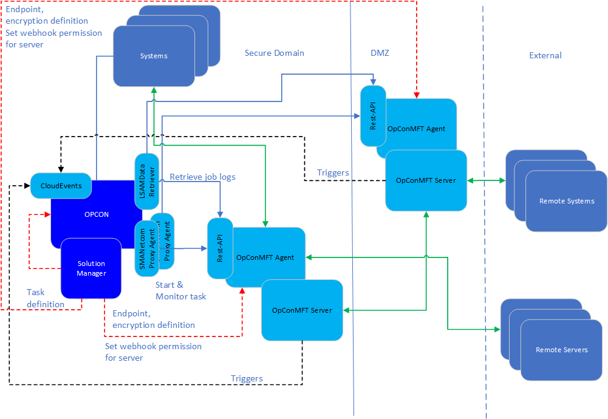

# OpCon MFT

OpCon MFT is a Managed File Transfer product integrated within the OpCon environment providing a comprehensive file transfer capability across
the Enterprise.

OpCon MFT consists of two major components that are integrated with OpCon using the Rest-API capabilities supported by the components.

Component | Description
------------------- | -----------
**OpConMFT Agent**  | is the client functionality providing B2B file transfer functionality. 
**OpConMFT Server** | is a full FTP server environment for receiving and routing incoming data as well as file sharing capabilities. 

The OpCon MFT environment comprises of many components that work together to provide the full Managed File Transfer solution.

## Solution Manager
Provides the User interface for the Managed File Transfer environment and provides capabilities for OpCon MFT task definition, defining  
endpoints, encryption information, a dashboard providing file transfer status and query functions for current and previous executions. 

During task definition, the endpoint and encryption information is retrieved from the OpConMFT Agent and provided in dropdown lists 
allowing the user to select the appropriate values. Task definitions are stored within the OpCon environment, while endpoint and encryption 
information is stored within the OpCOnMFT Agent environment. 

## OpConMFT ProxyAgent
The OpConMFT ProxyAgent provides the communications connections between OpCon and the OpConMFT Agent. The ProxyAgent accepts the traditional OpCon 
TX messages from SMANetcom, mapping them to OpConMFT Agent Rest-API calls. 

At a task start request, the OpCon unique jobId (integer portion) is passed to the OpConMFT Agent along with the task definition information. The ProxyAgent
receives the OpConMFT unique jobId as part of a successful task start and this value is saved in the OpCon database for restarting a failed OpConMFT task.

The ProxyAgent continuously monitors the status of the OpConMFT Agent marking the Agent as available or unavailable for job starts.

## LSAMDataRetriever
The LSAMDataRetriever has been modified to support the retrieval of job logs from the OpConMFT Agent through the OpConMFT Rest-API. The joblog provides
information about the task as well as each step executed within the task.

## OpConMFT Rest-API
The OpConMFT ProxyAgent communicates with the OpConMFT Agent through the OpConMFT Rest-API. 
The Rest-API provides the following functionalities:
- Start an OpConMFT Agent task.
- Monitor an OpConMFT task.
- Get the current status of an OpConMFT task.
- Retrieve the job log of an OpConMFT task.
- Retrieve a list of configured endpoints and encryption information for task definition.

## OpConMFT Agent 
The OpConMFT Agent provides a file transfer capability for B2B interactions. It supports the submission and retrieval of data files between
systems using a wide range of protocols such as FTP, FTPS, SFTP, SSH, S3, HTTP, HTTPS, optionally using compression and or encryption.
File transfers are performed between endpoints, which can be either **local** or **site**. 

There are two types of endpoints, local or site. 

Type       | Description
---------- | -----------
**local**  | references a file location (either UNC path or Windows path) relative to the Server that the OpConMFT Agent is installed on. 
**site**   | references a remote system and defines the the address, port, protocol and credentials required to access the site.

An OpConMFT task consists of multiple steps representing the received task definition. These steps consist of creating the file set for the transfer,
optionally using compression and or using encryption on the file set and transferring the file set to the destination.

During the task execution, the OpConMFT Agent persists each completed step. If a step fails and the task is restarted, the task will restart from the 
failed step.

## OpConMFT Server
(need information on implementation to complete the documentation)