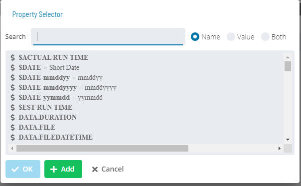
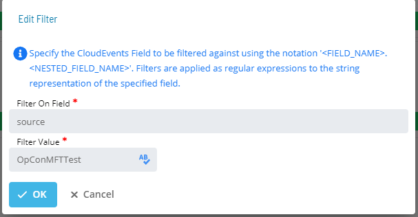
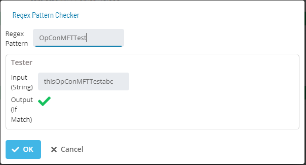
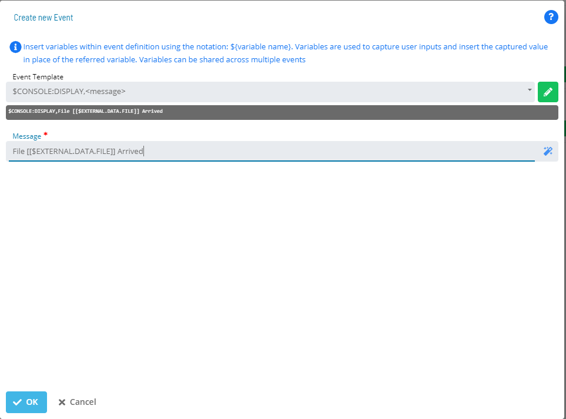
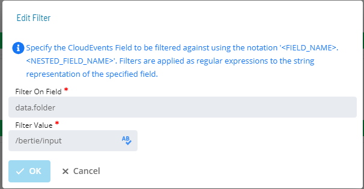
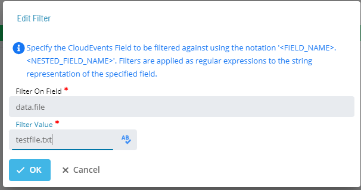
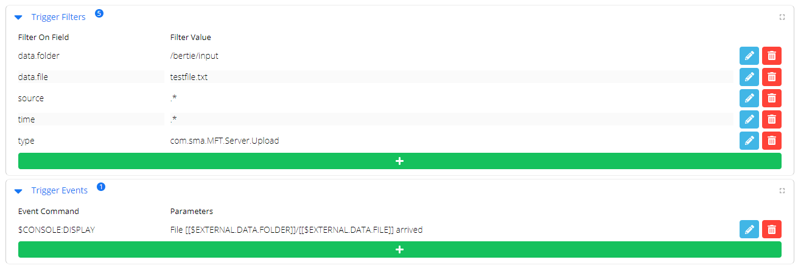

# MFT Server Triggers
OpCon supports a new capability called CloudEvents which allows events to be submitted to OpCon through a Webhook. 

OpCon MFT Server supports various triggers that are automatically forwarded to the OpCon CloudEvents environment allowing OpCon to perform actions based on the incoming triggers. These triggers are submitted to OpCon through the OpCon CloudEvents Webhook. During configuration, the OpCon MFT Server is registered with the OpCon CloudEvents Webhook. The registration process ensures that the OpCon MFT server is known to the OpCon system and abel to submit triggers. If the OpCon MFT Server is not correctly registered with the OpCon system all incoming triggers will be ignored.

## Event Trigger Types
The following event trigger types are supported:

Trigger ID | Trigger Type                      | Description
---------- | --------------------------------- | -----------
**0**      | MFT Server Logon                  | user logon occurred 
**1**      | MFT Server Logoff                 | user logoff occurred
**3**      | MFT Server Upload                 | a file was uploaded to the MFT server
**4**      | MFT Server Download               | a file was downloaded from the MFT server
**6**      | MFT Server Start                  | the OpCon MFT server has started
**7**      | MFT Server Copy File              | a file on the MFT server has been copied
**8**      | MFT Server Move File              | a file has been moved within the MFT server      
**9**      | MFT Server Move Directory         | a directory has been moved within the MFT server      
**10**     | MFT Server Delete File            | a file has been deleted from the MFT server 
**11**     | MFT Server Delete Directory       | a directory has been deleted from the MFT server   

## Using CloudEvents
The CloudEvents implementation allows the mapping of incoming trigger events to OpCon Events allowing OpCon to perform actions based on the trigger events received. 
Trigger filters are defined to reference specific event triggers received and Trigger Events define the action to be taken.

To define trigger filter event mapping open the **CloudEvents Triggers** item in the **Library Management** section of Solution Manager.

To define a CloudEvent, first define the Trigger Filter (what to look for) followed by the Trigger Event (what action to take).

Filters can be applied to the following types. Once a type has been selected, additional filters can be added on specific items within the type.  

Type        | Description
----------- | --------------------------------- 
**source**  | indicates filter on where the message came from
**type**    | indicates filter on a trigger type
**time**    | indicates filter on time

## Filter 'source'

The source filter can be used to determine where the trigger came from.

For OpConMFT systems, use the name of the OpCon MFT Agent.

## Filter 'type'

Each trigger type has various fields that can be used to create additional filters. Once a trigger type has been selected, any further type filters will
provide a drop-down list containing the available fields to filter on for the selected type.   

Trigger Type  : MFT Server Logon 
- data.logonUserName
- data.homeDir
- data.protocol
- data.remoteip
- data.result

Trigger Type  : MFT Server Logoff 
- data.logonUserName
- data.homeDir
- data.protocol
- data.remoteip
- data.result

Trigger Type  : MFT Server Upload 
- data.file
- data.folder
- data.path
- data.fileDateTime
- data.fileSize
- data.logonUserName
- data.homeDir
- data.protocol
- data.remoteip
- data.result
- data.duration

Trigger Type  : MFT Server Download 
- data.file
- data.folder
- data.path
- data.fileDateTime
- data.fileSize
- data.logonUserName
- data.homeDir
- data.protocol
- data.remoteip
- data.result
- data.duration

Trigger Type  : MFT Server Start
- data.name
- data.result

Trigger Type  : MFT Server Copy File 
- data.file
- data.folder
- data.path
- data.fileDateTime
- data.fileSize
- data.targetFile
- data.targetFolder
- data.targetPath
- data.targetFileDateTime
- data.targetFileSize
- data.logonUserName
- data.homeDir
- data.protocol
- data.remoteip
- data.result
- data.duration

Trigger Type  : MFT Server Move File 
- data.file
- data.folder
- data.path
- data.fileDateTime
- data.fileSize
- data.targetFile
- data.targetFolder
- data.targetPath
- data.targetFileDateTime
- data.targetFileSize
- data.logonUserName
- data.homeDir
- data.protocol
- data.remoteip
- data.result
- data.duration

Trigger Type  : MFT Server Move Directory 
- data.file
- data.folder
- data.path
- data.fileDateTime
- data.fileSize
- data.targetFile
- data.targetFolder
- data.targetPath
- data.targetFileDateTime
- data.targetFileSize
- data.logonUserName
- data.homeDir
- data.protocol
- data.remoteip
- data.result
- data.duration

Trigger Type  : MFT Server Delete File 
- data.file
- data.folder
- data.path
- data.fileDateTime
- data.fileSize
- data.logonUserName
- data.homeDir
- data.protocol
- data.remoteip
- data.result
- data.duration

Trigger Type  : MFT Server Delete Directory 
- data.file
- data.folder
- data.path
- data.fileDateTime
- data.fileSize
- data.logonUserName
- data.homeDir
- data.protocol
- data.remoteip
- data.result
- data.duration

## Filter 'time'
The filter time uses regex patterns. 
Future versions of the filter process will include more user friendly approaches to match date/time values.  

## Using Regex Expressions
When defining filters that have data fields, it possible to use wild cards. However, it should be noted that this is a regex expression and not a wild card selection, therefore
  - wildcard **input?.dta** becomes **input..dta**
  - wildcard **input?.\*** becomes **input..\***
  - wildcard **input.\*** becomes **input.\***
  - wildcard **\*.dta** not supported 

## Checking for failed conditions
The **data.result** field can be used to determine if function failed. When combined with the MFT Server Upload / Download types, transfer failure can be detected.
If the **data.result** value is greater than 0 the function failed.
Using the **data.result** field and setting the regex expression to **^[1-9]\\d\*$** catches a failed result code.

## Using Data fields in OpCon Events
It is possible that in some cases, when defining OpCon events, the data fields are not visible in the drop-down lists. If this is the case then the field can
be entered manually by using the [[$EXTERNAL.DATA.field]] value.

## Trigger Events
Trigger events define the action to take when the filter conditions match. The events are standard OpCon events. 
When defining events, the **data** fields associated with the selected Trigger Types can be used to pass information to the event.

To select a Filter Type value, select the **magic wand** to the right of the Event definition field.
The required argument can then be selected from the drop-down list (arguments are prefixed with the DATA and when inserted into the event definition as [[$EXTERNAL.DATA.argument]]).

## Examples

### ***Display a message on the console when any file arrives on a specific OpCon MFT Server***

A simple CloudEvent to display the name of all incoming files received by the defined MFT Server in the OpCon console. 

- Select the **+ Add** button.
- For **Filter On Field** select **source** from the drop-down list.

- For **Filter Value** enter the name of the OpConMFT system (the OpConMFT Agent name). When selected, the regex checker icon to the right of the field can be used to test the regex expression.

- Select **OK**
- Select the green **+** bar below Trigger Filters to add a type filter.  
- For **Filter On Field** select **type** from the drop-down list.

- For **Filter Value** select **MFT Server Upload** from the drop-down list.
- Select **OK**
- Select the green **+** bar below Trigger Events to add an event. 

- For **Event Template** select **$CONSOLE:Display** from the drop-down list.
- In the message section 
    - enter **File **.
    - select the **Magic Wand** to the right of the field.
    - select **$ DATA.FILE** from the drop-down list and select **OK**.
    - enter ** Arrived**.
- Select **OK**.    

- Select **Save** to save and activate the filter.

### ***Display a message when a specific file arrives in a specific directory on the associated OpCon MFT Server***

Includes multiple filters to detect when a specific file arrives in a specific directory on the MFT Server and displays this in the OpCon console. 

- Select the **+ Add** button.
- Enter a unique name for the filter in the **Name** field.
- Select the green **+** bar below Trigger Filters to add a filter.

- For **Filter On Field** select **type** from the drop-down list.
- For **Filter Value** select **MFT Server Upload** from the drop-down list.
- Select **OK**
- Select the green **+** bar below Trigger Filters to add a second filter for directory. 
    - As this is a second filter on the selected type **MFT Server Upload** the drop-down list now contains values that are associated with the event details. The items are prefixed with the word 'data' to indicate that this item is part of the event details.
- Select **data.folder** from the drop-down.
- enter **/bertie/input** to indicate which directory the file should arrive in.

- Select **OK**.

- Select the green **+** bar below Trigger Filters to add a third filter for file name. 
    - As this is a third filter on the selected type **MFT Server Upload** the drop-down list now contains values that are associated with the event details. However any previously used values are no longer available in the drop-down list.
- Select **data.file** from the drop-down.
- enter **testfile.txt** to indicate which directory the file should arrive in.
- Select **OK**.

- Select the green **+** bar below Trigger Events to add an event. 
- For **Event Template** select **$CONSOLE:Display** from the drop-down list.
- In the message section 
    - enter **File **.
    - select the **Magic Wand** to the right of the field.
    - select **$ DATA.FOLDER** from the drop-down list and select **OK**.
    - enter **/**.
    - select **$ DATA.FILE** from the drop-down list and select **OK**.
    - enter ** Arrived**.
  

- Select **OK**.  

- Select **Save** to save and activate the filter.

